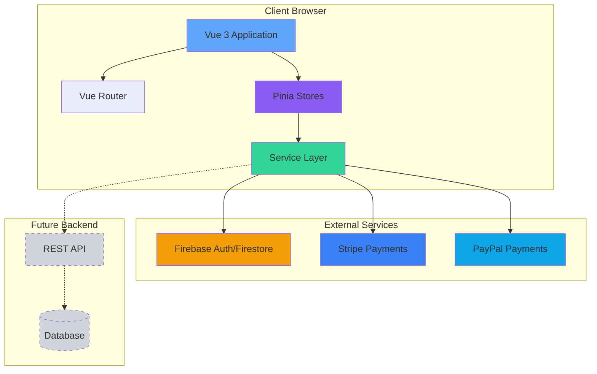
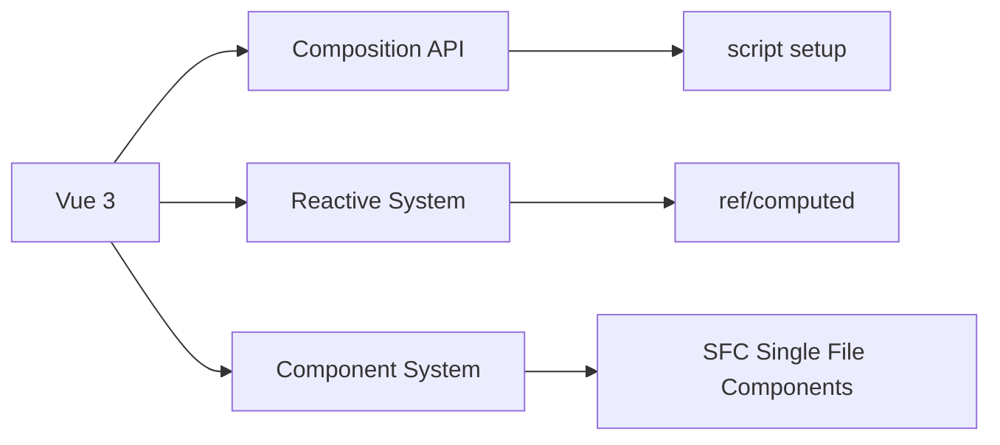
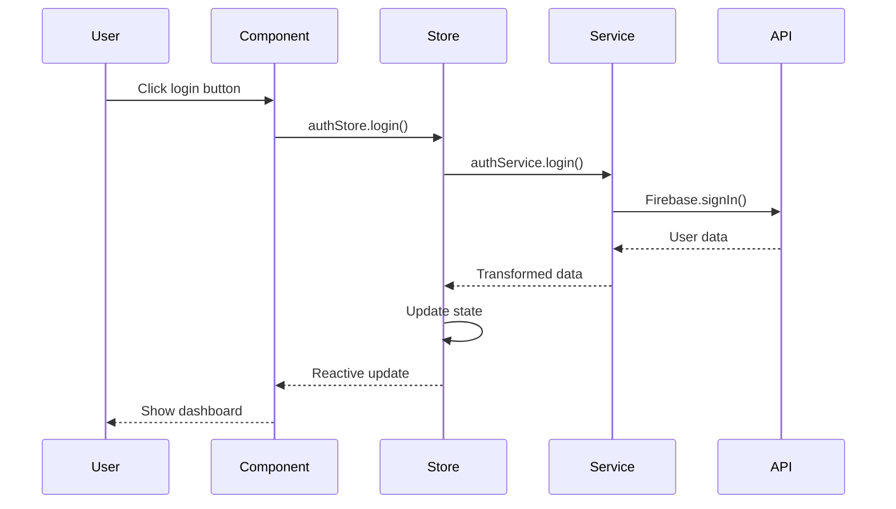
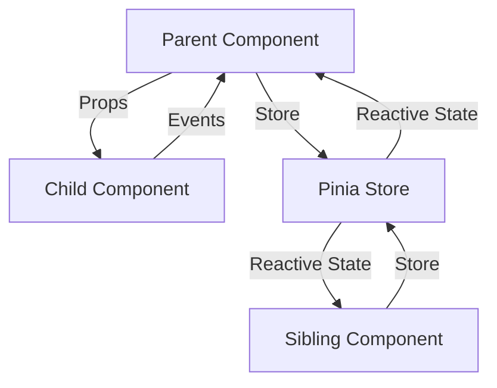
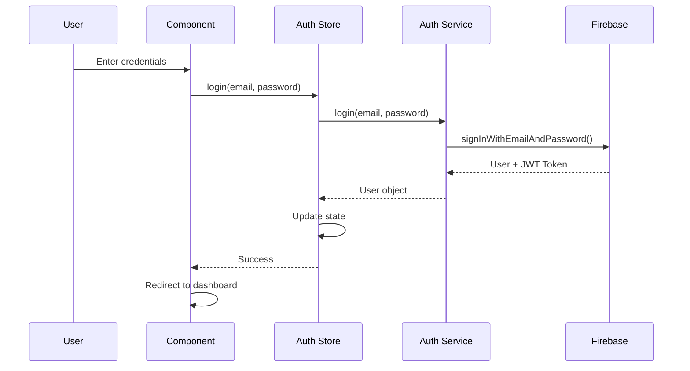

# GeekDigital - Architecture Overview

Last Updated: 2025-01-21

## Table of Contents

1. [System Architecture](#system-architecture)
2. [Technology Stack](#technology-stack)
3. [Design Patterns](#design-patterns)
4. [Application Layers](#application-layers)
5. [Data Flow](#data-flow)
6. [Component Architecture](#component-architecture)
7. [State Management](#state-management)
8. [Routing Architecture](#routing-architecture)
9. [Security Architecture](#security-architecture)
10. [Scalability Considerations](#scalability-considerations)
11. [Future Architecture](#future-architecture)

---

## System Architecture

### High-Level Overview

GeekDigital is a Single-Page Application (SPA) built with Vue 3, implementing a modern frontend architecture with clear separation of concerns.



### Architecture Style

**Pattern**: Layered Frontend Architecture

**Benefits**:

- Clear separation of concerns
- Easy to test and maintain
- Modular and scalable
- Technology-agnostic layers

---

## Technology Stack

### Core Framework



| Technology | Version | Purpose |
|-----------|---------|---------|
| **Vue 3** | 3.4.21 | Progressive JavaScript framework |
| **Vite** | 5.1.6 | Build tool and dev server |
| **JavaScript/ES6+** | ES2022 | Programming language |

**Why Vue 3?**

- Modern Composition API
- Excellent performance
- Strong ecosystem
- Great developer experience

**Why Vite?**

- Extremely fast HMR
- Optimized builds
- Native ES modules
- Simple configuration

---

### UI and Styling

```diagram
┌─────────────────────────────────────────┐
│         Tailwind CSS Framework          │
├─────────────────────────────────────────┤
│  Utility Classes  │  Custom Components  │
├──────────────────┼─────────────────────┤
│   PostCSS Layer  │   Autoprefixer      │
└─────────────────────────────────────────┘
```

| Technology | Version | Purpose |
|-----------|---------|---------|
| **Tailwind CSS** | 3.4.1 | Utility-first CSS framework |
| **PostCSS** | 8.4.35 | CSS processing |
| **Autoprefixer** | 10.4.18 | Automatic vendor prefixing |

**Design System**:

- Primary Color: Blue (#3B82F6)
- Secondary Color: Purple (#8B5CF6)
- Responsive: Mobile-first approach
- Custom component classes for consistency

---

### State Management and Routing

```diagram
Application State
      ↓
┌───────────┐
│   Pinia   │ ← Modern, lightweight
└─────┬─────┘
      │
      ├─── auth.js (Authentication)
      ├─── cart.js (Shopping)
      └─── user.js (User data)

Navigation
      ↓
┌──────────────┐
│  Vue Router  │ ← Official routing
└──────┬───────┘
       │
       ├─── Layout-based routing
       ├─── Navigation guards
       └─── Lazy loading
```

| Technology | Version | Purpose |
|-----------|---------|---------|
| **Pinia** | 2.1.7 | State management (Vuex successor) |
| **Vue Router** | 4.3.0 | Official routing library |

---

### Backend Services

```diagram
┌────────────────┐
│ Authentication │ ──→ Firebase Auth
└────────────────┘

┌────────────────┐
│    Database    │ ──→ Firestore (future)
└────────────────┘

┌────────────────┐
│    Payments    │ ──→ Stripe + PayPal
└────────────────┘

┌────────────────┐
│   HTTP Client  │ ──→ Axios
└────────────────┘
```

| Technology | Version | Purpose |
|-----------|---------|---------|
| **Firebase** | 10.9.0 | Authentication, database, storage |
| **Supabase** | 2.39.7 | Alternative auth (configured) |
| **Stripe** | 3.0.6 | Payment processing |
| **Axios** | 1.6.7 | HTTP client |

---

## Design Patterns

### 1. Layered Architecture Pattern

```diagram
┌─────────────────────────────────────────┐
│     Presentation Layer (Components)     │ ← User Interface
├─────────────────────────────────────────┤
│  State Management Layer (Pinia Stores)  │ ← Application State
├─────────────────────────────────────────┤
│     Service Layer (Business Logic)      │ ← External APIs
├─────────────────────────────────────────┤
│   Integration Layer (SDKs/HTTP)         │ ← Communication
└─────────────────────────────────────────┘
```

**Benefits**:

- Separation of concerns
- Easy to test layers independently
- Clear dependencies (top to bottom)
- Flexible (swap implementations)

---

### 2. Composition API Pattern

**Traditional Options API**:

```vue
<script>
export default {
  data() {
    return { count: 0 }
  },
  methods: {
    increment() { this.count++ }
  }
}
</script>
```

**Modern Composition API**:

```vue
<script setup>
import { ref } from 'vue'
const count = ref(0)
const increment = () => count.value++
</script>
```

**Benefits**:

- Better code organization
- Easier to extract and reuse logic
- Better TypeScript support
- Smaller bundle size

---

### 3. Service Layer Pattern

```javascript
// Service abstracts external API
class AuthService {
  async login(email, password) {
    // Handle Firebase, error transformation, demo mode
  }
}
export const authService = new AuthService()

// Store uses service
const login = async (email, password) => {
  const user = await authService.login(email, password)
  user.value = user
}

// Component uses store
const handleLogin = () => {
  authStore.login(email, password)
}
```

**Benefits**:

- Centralized API communication
- Easy to mock for testing
- Consistent error handling
- Demo mode fallbacks

---

### 4. Store Module Pattern

```text
store/
└── modules/
    ├── auth.js      ← Authentication domain
    ├── cart.js      ← Shopping domain
    └── user.js      ← User data domain
```

**Benefits**:

- Clear domain boundaries
- Independent testing
- Code splitting
- Team collaboration

---

### 5. Layout Pattern

```diagram
Routes
  ↓
┌─────────────────┐
│ DefaultLayout   │ ← Navbar + Footer
│  ├─ Home        │
│  ├─ Shop        │
│  └─ Dashboard   │
└─────────────────┘

┌─────────────────┐
│  AuthLayout     │ ← Clean, centered
│  └─ Login       │
└─────────────────┘
```

**Benefits**:

- DRY (Don't Repeat Yourself)
- Consistent navigation
- Easy layout switching
- Cleaner route config

---

### 6. Repository Pattern (Future)

```javascript
// Future: Repository layer for data access
class UserRepository {
  async findById(id) {
    return await api.get(`/users/${id}`)
  }

  async update(id, data) {
    return await api.put(`/users/${id}`, data)
  }
}
```

**Benefits**:

- Abstraction over data source
- Easier to change backend
- Consistent data access patterns

---

## Application Layers

### Layer 1: Presentation (UI)

**Responsibility**: User interface and interaction

```text
Components/
├── Pages (Route-level)
│   ├── Home.vue
│   ├── Dashboard.vue
│   └── Shop.vue
├── Layouts (Wrappers)
│   ├── DefaultLayout.vue
│   └── AuthLayout.vue
└── Common (Reusable)
    ├── Navbar.vue
    └── Footer.vue
```

**Characteristics**:

- Vue Single File Components (SFC)
- Tailwind CSS styling
- Props/emits for communication
- Minimal business logic

**Example**:

```vue
<script setup>
import { useAuthStore } from '@/store/modules/auth'
const authStore = useAuthStore()
</script>

<template>
  <div v-if="authStore.isAuthenticated">
    Welcome, {{ authStore.userName }}
  </div>
</template>
```

---

### Layer 2: State Management

**Responsibility**: Application state and computed data

```text
Store Modules:
├── auth.js
│   ├── State: user, loading, error
│   ├── Getters: isAuthenticated, userName
│   └── Actions: login, logout, register
├── cart.js
│   ├── State: items
│   ├── Getters: totalPrice, itemCount
│   └── Actions: addItem, removeItem
└── user.js
    ├── State: purchasedApps, licenses
    ├── Getters: hasPurchasedApp
    └── Actions: loadUserData, addPurchasedApp
```

**Data Flow**:

```text
Component triggers action
      ↓
Store action calls service
      ↓
Service returns data
      ↓
Store updates state
      ↓
Component re-renders (reactive)
```

---

### Layer 3: Service Layer

**Responsibility**: Business logic and external API communication

```text
Services:
├── authService.js
│   └── Firebase authentication wrapper
├── paymentService.js
│   └── Stripe + PayPal integration
└── firebase.js
    └── SDK initialization
```

**Pattern**:

```javascript
class ServiceName {
  async method(params) {
    try {
      const result = await externalAPI(params)
      return this.transform(result)
    } catch (error) {
      throw this.handleError(error)
    }
  }
}
export const serviceName = new ServiceName()
```

---

### Layer 4: Integration Layer

**Responsibility**: Communication with external services

```text
External Integrations:
├── Firebase SDK
│   ├── Authentication
│   ├── Firestore
│   └── Storage
├── Stripe SDK
│   └── Payment processing
├── PayPal SDK
│   └── Alternative payments
└── Axios
    └── HTTP client for APIs
```

---

## Data Flow

### Unidirectional Data Flow



### Example: Login Flow

```javascript
// 1. User action (Component)
const handleLogin = async () => {
  await authStore.login(email.value, password.value)
}

// 2. Store action
const login = async (email, password) => {
  loading.value = true
  try {
    // 3. Service call
    const userData = await authService.login(email, password)
    // 4. Update state
    user.value = userData
  } catch (error) {
    error.value = error.message
  } finally {
    loading.value = false
  }
}

// 5. Service implementation
async login(email, password) {
  // 6. External API
  const userCredential = await signInWithEmailAndPassword(auth, email, password)
  return userCredential.user
}

// 7. Component re-renders (reactive)
<div v-if="authStore.isAuthenticated">
  Welcome!
</div>
```

---

## Component Architecture

### Component Hierarchy

```text
App.vue (Root)
  │
  ├── DefaultLayout
  │   ├── Navbar
  │   ├── router-view (Pages)
  │   │   ├── Home
  │   │   ├── Catalog
  │   │   ├── Portfolio
  │   │   ├── Shop
  │   │   └── Dashboard
  │   └── Footer
  │
  └── AuthLayout
      └── router-view
          └── Login
```

### Component Types

#### 1. Page Components

- Route-level components
- Orchestrate features
- Connect to stores
- Example: `Dashboard.vue`, `Shop.vue`

#### 2. Layout Components

- Structural wrappers
- Provide navigation
- Example: `DefaultLayout.vue`

#### 3. UI Components

- Reusable elements
- Accept props, emit events
- Example: `Navbar.vue`, `Footer.vue`

### Component Communication



**Patterns**:

- **Parent → Child**: Props
- **Child → Parent**: Events (emit)
- **Sibling ↔ Sibling**: Pinia Store
- **Global State**: Pinia Store

---

## State Management

### Pinia Architecture

```diagram
┌──────────────────────────────────────┐
│           Pinia Store                 │
├──────────────────────────────────────┤
│  State (ref)                          │
│  - Reactive data                      │
├──────────────────────────────────────┤
│  Getters (computed)                   │
│  - Derived state                      │
├──────────────────────────────────────┤
│  Actions (functions)                  │
│  - State mutations                    │
│  - Async operations                   │
└──────────────────────────────────────┘
```

### Store Structure

```javascript
export const useAuthStore = defineStore('auth', () => {
  // ===== STATE =====
  const user = ref(null)
  const loading = ref(false)

  // ===== GETTERS =====
  const isAuthenticated = computed(() => !!user.value)

  // ===== ACTIONS =====
  const login = async (email, password) => {
    loading.value = true
    try {
      user.value = await authService.login(email, password)
    } finally {
      loading.value = false
    }
  }

  // ===== RETURN =====
  return { user, loading, isAuthenticated, login }
})
```

### State Persistence

```diagram
┌─────────────┐
│   Pinia     │
│   Store     │
└──────┬──────┘
       │
       ├─── Cart ────→ localStorage (immediate)
       │
       ├─── User ────→ localStorage (demo mode)
       │              └→ Backend API (future)
       │
       └─── Auth ────→ Firebase (automatic)
```

---

## Routing Architecture

### Route Configuration

```javascript
const routes = [
  {
    path: '/',
    component: DefaultLayout,      // Layout wrapper
    children: [
      {
        path: '',
        name: 'Home',
        component: Home,
        meta: { title: 'Home' }
      },
      {
        path: 'dashboard',
        name: 'Dashboard',
        component: () => import('@/pages/Dashboard.vue'),  // Lazy load
        meta: {
          requiresAuth: true,       // Protected route
          title: 'Dashboard'
        }
      }
    ]
  },
  {
    path: '/auth',
    component: AuthLayout,
    children: [
      {
        path: 'login',
        name: 'Login',
        component: Login,
        meta: { guest: true }        // Guest-only route
      }
    ]
  }
]
```

### Navigation Guards

```javascript
router.beforeEach((to, from, next) => {
  // Set page title
  document.title = to.meta.title || 'GeekDigital'

  const authStore = useAuthStore()

  // Protected routes
  if (to.meta.requiresAuth && !authStore.isAuthenticated) {
    next({ name: 'Login', query: { redirect: to.fullPath } })
  }
  // Guest-only routes
  else if (to.meta.guest && authStore.isAuthenticated) {
    next({ name: 'Dashboard' })
  }
  else {
    next()
  }
})
```

### Code Splitting

```text
Build Output:
├── index.html
├── assets/
│   ├── index-[hash].js      ← Main bundle (~150KB)
│   ├── Home-[hash].js        ← Lazy-loaded
│   ├── Dashboard-[hash].js   ← Lazy-loaded
│   └── Shop-[hash].js        ← Lazy-loaded
```

**Benefits**:

- Faster initial load
- Load pages on-demand
- Better caching

---

## Security Architecture

### Authentication Flow



### Security Layers

```diagram
┌────────────────────────────────────────┐
│  1. HTTPS/SSL (Transport Security)    │
├────────────────────────────────────────┤
│  2. Firebase Auth (Authentication)     │
├────────────────────────────────────────┤
│  3. Route Guards (Authorization)       │
├────────────────────────────────────────┤
│  4. Environment Variables (Config)     │
├────────────────────────────────────────┤
│  5. CSP Headers (XSS Protection)       │
└────────────────────────────────────────┘
```

### Data Security

**Client-Side**:

- No sensitive data in code
- Environment variables for keys
- Public keys only (Stripe)
- HTTPS required

**Server-Side (Future)**:

- Backend validates all payments
- Server-side Firebase Admin SDK
- Database security rules
- API rate limiting

---

## Scalability Considerations

### Current Scalability

```text
Current Architecture:
├── Frontend: Infinitely scalable (static files + CDN)
├── Authentication: Firebase (Google-scale infrastructure)
├── Payments: Stripe/PayPal (managed services)
└── Data: localStorage (demo) → Firebase (production)
```

**Limitations**:

- localStorage not shared across devices
- No real-time sync
- Limited to Firebase quotas

### Future Scalability

```diagram
Proposed Architecture:
┌──────────────────────────────────────┐
│        CDN (Static Assets)           │
└─────────────┬────────────────────────┘
              │
┌─────────────▼────────────────────────┐
│      Load Balancer (API)             │
└─────────────┬────────────────────────┘
              │
    ┌─────────┼─────────┐
    │         │         │
┌───▼───┐ ┌──▼───┐ ┌──▼───┐
│ API 1 │ │ API 2│ │ API 3│
└───┬───┘ └──┬───┘ └──┬───┘
    │        │        │
    └────────┼────────┘
             │
      ┌──────▼───────┐
      │   Database   │
      │  (Postgres/  │
      │   MongoDB)   │
      └──────────────┘
```

**Enhancements**:

1. **Backend API**: Node.js/Express or Python/FastAPI
2. **Database**: PostgreSQL or MongoDB
3. **Caching**: Redis for sessions/cart
4. **Queue**: Bull/RabbitMQ for async tasks
5. **Storage**: S3/Cloud Storage for files
6. **Search**: Elasticsearch for product search
7. **Real-time**: WebSockets for notifications

---

## Future Architecture

### Phase 1: Backend API (Next 3 months)

```text
Add Backend:
├── REST API (Node.js + Express)
├── Database (PostgreSQL)
├── Authentication (JWT + Firebase)
└── Payment webhooks (Stripe/PayPal)
```

**Changes**:

- Replace localStorage with API calls
- Server-side payment verification
- Real-time data sync
- Multi-device support

---

### Phase 2: Advanced Features (6 months)

```text
New Features:
├── Admin Dashboard
├── Product Management
├── Order Management
├── Analytics Dashboard
├── Email Notifications
└── Download Management
```

**Architecture**:

```text
Frontend (Vue 3)
    ↓
API Gateway
    ↓
Microservices:
├── User Service
├── Product Service
├── Order Service
├── Payment Service
└── Notification Service
```

---

### Phase 3: Scale (12 months)

```text
Enterprise Architecture:
├── Multi-region deployment
├── Containerization (Docker + Kubernetes)
├── Service mesh (Istio)
├── Observability (Prometheus + Grafana)
├── CI/CD (GitHub Actions)
└── Infrastructure as Code (Terraform)
```

---

## Architecture Principles

### 1. Separation of Concerns

Each layer has a single, well-defined responsibility.

### 2. Dependency Inversion

Higher layers depend on abstractions, not concrete implementations.

### 3. Single Source of Truth

Pinia stores are the canonical source of application state.

### 4. Unidirectional Data Flow

Data flows down (props), events flow up (emits), state flows through stores.

### 5. Progressive Enhancement

Application works without external services (demo mode).

### 6. Performance First

Lazy loading, code splitting, optimized builds.

### 7. Developer Experience

Fast HMR, clear structure, comprehensive documentation.

---

## Technology Decisions

### Why Vue 3 over React?

- Simpler learning curve
- Better performance (smaller runtime)
- Official router and state management
- Excellent documentation
- Progressive framework (use what you need)

### Why Pinia over Vuex?

- Simpler API
- Better TypeScript support
- Composition API native
- Smaller bundle size
- Official Vuex successor

### Why Tailwind over CSS-in-JS?

- Faster development
- Smaller bundle (purged unused CSS)
- No runtime overhead
- Consistent design system
- Great developer experience

### Why Firebase over Custom Backend?

- Faster development
- Google-scale infrastructure
- Built-in authentication
- Real-time capabilities
- Free tier generous
- Easy to migrate later

---

## Performance Architecture

### Build Performance

```text
Vite Build Pipeline:
1. Parse and transform (esbuild - Go)
2. Bundle (Rollup)
3. Minify (Terser)
4. Code split (automatic)
5. Asset optimization
6. Generate manifest

Result: <2s builds
```

### Runtime Performance

```text
Vue 3 Optimizations:
├── Virtual DOM (faster diffing)
├── Compiler hints
├── Tree-shaking (remove unused code)
├── Static hoisting
└── Patch flag optimization
```

### Loading Performance

```text
Page Load Strategy:
1. HTML (index.html)           - 1KB
2. Critical CSS                - 12KB (gzipped)
3. Main JS bundle              - 150KB (gzipped)
4. Lazy-loaded routes          - On demand
5. External SDKs               - Async loaded
```

---

## Conclusion

GeekDigital's architecture provides:

- **Scalability**: Easy to add features and scale
- **Maintainability**: Clear structure and patterns
- **Performance**: Optimized for speed
- **Security**: Multiple security layers
- **Developer Experience**: Modern tooling and fast feedback

The architecture supports current needs while being flexible enough to evolve as requirements grow.

---

For more details, see:

- [API_REFERENCE.md](./API_REFERENCE.md) - Detailed API documentation
- [DEVELOPMENT_GUIDE.md](./DEVELOPMENT_GUIDE.md) - Development workflows
- [DEPLOYMENT_GUIDE.md](./DEPLOYMENT_GUIDE.md) - Deployment strategies
